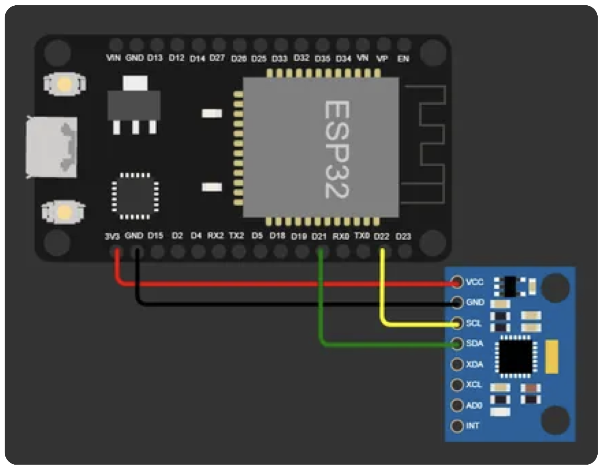
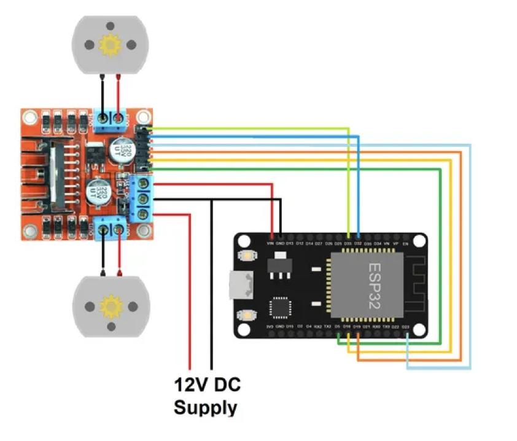
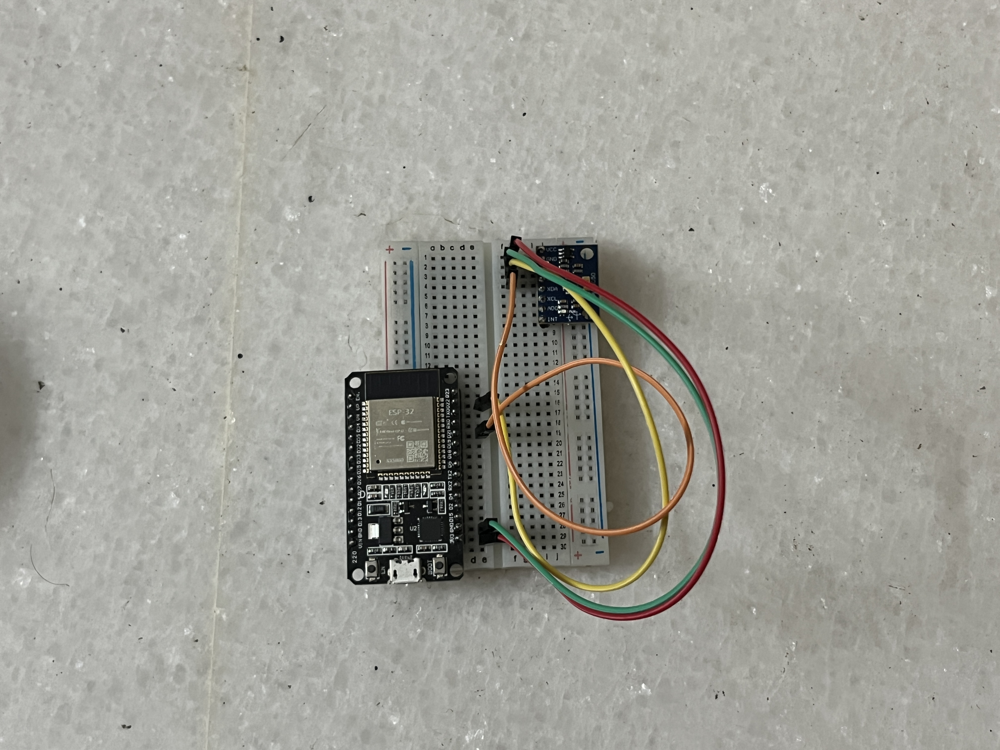
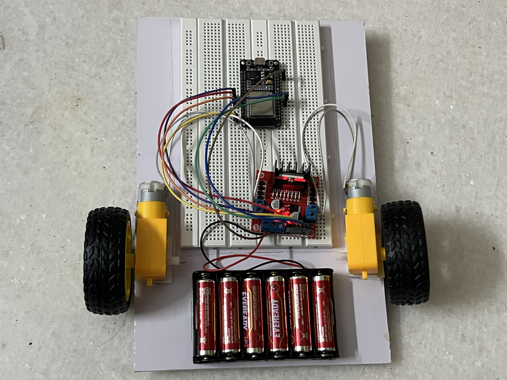

# 🎮 Gesture Controlled Robot using ESP32 (ESP-NOW)

A wireless gesture-controlled robot built using ESP32 microcontrollers and an MPU6050 motion sensor. The robot is controlled by hand movements and communicates using the low-latency ESP-NOW protocol.

---

## 👥 Team Members

- Arvind Bharadwaj, PES1UG24AM052
- Akhil Mangipudi, PES1UG24AM023
- Akshit Singhal, PES1UG24AM027

---

## 📌 Overview

This project implements a **gesture-based control system** for a mobile robot. A wearable transmitter captures hand motion using an MPU6050 sensor and sends directional commands wirelessly to a receiver ESP32, which controls the robot’s motors via an L298N motor driver.

---

## ⚙️ System Architecture

```
Hand Gesture
     ↓
MPU6050 Sensor
     ↓
ESP32 (Transmitter)
     ↓
ESP-NOW Communication
     ↓
ESP32 (Receiver)
     ↓
L298N Motor Driver
     ↓
DC Motors
     ↓
Robot Movement
```

---

## 🚀 Features

- 🎮 Gesture-based control (no joystick required)
- 📡 Wireless communication using ESP-NOW
- ⚡ Low latency response
- 🔄 Smooth motor control with safe switching logic
- 🧠 Real-time motion interpretation

---

## 📦 Components Used

- ESP32 Development Board × 2
- MPU6050 (GY-521 module)
- L298N Motor Driver
- DC Gear Motors × 2
- Robot Chassis + Wheels + Caster
- Battery Pack (6× AA recommended)
- Jumper Wires
- Breadboard

---

## 🔌 Circuit Connections

### 🖐️ Transmitter (MPU6050 → ESP32)

| MPU6050 Pin | ESP32 Pin |
| ----------- | --------- |
| VCC         | 3.3V      |
| GND         | GND       |
| SDA         | GPIO 21   |
| SCL         | GPIO 22   |

---

### 🤖 Receiver (ESP32 → L298N)

| L298N Pin | ESP32 Pin |
| --------- | --------- |
| IN1       | GPIO 18   |
| IN2       | GPIO 19   |
| IN3       | GPIO 23   |
| IN4       | GPIO 32   |
| ENA       | GPIO 5    |
| ENB       | GPIO 33   |
| GND       | ESP32 GND |

---

### 🔋 Power Connections

- Motor Power → External Battery (6× AA) to L298N
- ESP32 → Powered via USB (recommended)
- **Common Ground required between ESP32 and L298N**

---

## 📷 Circuit / Setup Images

> Add your images here after uploading them to the repository

  
  



---

## 🧠 Working Principle

### Transmitter

- MPU6050 reads tilt angles (X, Y)
- Direction determined using threshold logic:
  - Forward tilt → Move forward
  - Backward tilt → Move backward
  - Left tilt → Turn left
  - Right tilt → Turn right
- Data is transmitted using ESP-NOW

---

### Receiver

- Receives gesture data via ESP-NOW
- Controls motors using L298N driver
- Uses safe switching logic:
  - Stop → Delay → Change direction → Move

---

## 📡 Communication (ESP-NOW)

ESP-NOW enables:

- Peer-to-peer communication
- No Wi-Fi router required
- Low latency control

### Data Structure

```cpp
typedef struct {
  bool f;
  bool b;
  bool l;
  bool r;
} message;
```

---

## ⚠️ Challenges Faced

- Power instability causing brownout resets
- Motor noise affecting ESP32 stability
- Incorrect MAC address configuration
- Sudden direction switching causing erratic motion

---

## ✅ Solutions

- Implemented safe motor switching (stop before reverse)
- Reduced motor speed to avoid voltage dips
- Ensured common ground across all components
- Verified ESP-NOW peer MAC addresses

---

## 📊 Results

- Successful real-time gesture control
- Smooth directional movement
- Stable wireless communication
- Reliable robot operation after optimization

---

## 📚 Applications

- Assistive robotics
- Human–machine interfaces
- Remote control systems
- Educational robotics

---

## 🏁 Conclusion

This project demonstrates how embedded systems, sensors, and wireless communication can be integrated to build an intuitive and responsive robotic system controlled entirely by human gestures.
